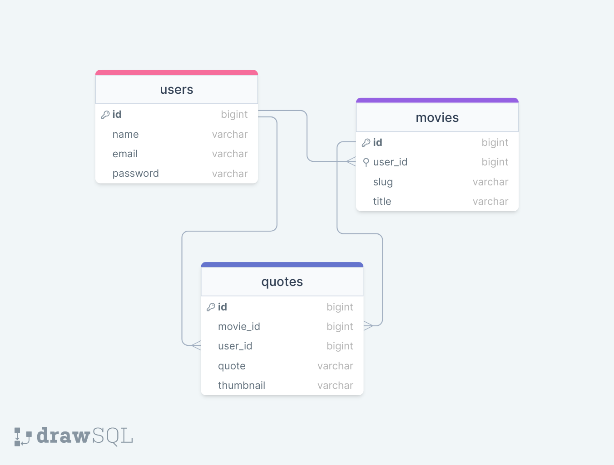

<div style="display:flex; align-items: center">
  <h1 style="position:relative; top: -6px" >Random Movie Quotes</h1>
</div>


Random movie quotes app displays a random movie with a random quote.
Authorized user can add any movie with any number of favourite quotes in english and georgian languages. One can upload a representational image that will be displayed on the main page among all others' randomly.
--
PS There is also an option to add as many languages as possible just by adding an additional language option in config file.

#
### Table of Contents
* [Prerequisites](#prerequisites)
* [Tech Stack](#tech-stack)
* [Getting Started](#getting-started)
* [Migrations](#migration)
* [Create Admin](#create-admin)
* [Development](#development)
* [Project Structure](#project-structure)
* [Database Design Diagram](#database-design-diagram)

#
### Prerequisites

*  *PHP@8.02 and up*
*  *MYSQL@8 and up*
*  *npm@6 and up*
*  *composer@2 and up*


#
### Tech Stack

*  [Laravel@9.x](https://laravel.com/docs/6.x) - back-end framework
*  [Spatie Translatable](https://github.com/spatie/laravel-translatable) - package for translation

#
### Getting Started
1\. First of all you need to clone Random Movie Quotes repository from github:
```sh
git clone https://github.com/RedberryInternship/lomidze-movie-quotes.git
```

2\. Next step requires you to run *composer install* in order to install all the dependencies.
```sh
composer install
```

3\. after you have installed all the PHP dependencies, it's time to install all the JS dependencies:
```sh
npm install
```

and also:
```sh
npm run dev
```
in order to build your tailwind resources.

4\. Now we need to set our env file. Go to the root of your project and execute this command.
```sh
cp .env.example .env
```
And now you should provide **.env** file all the necessary environment variables:

#
**MYSQL:**
>DB_CONNECTION=mysql

>DB_HOST=127.0.0.1

>DB_PORT=3306

>DB_DATABASE=*****

>DB_USERNAME=*****

>DB_PASSWORD=*****

##### Now, you should be good to go!


#
### Migration
if you've completed getting started section, then migrating database if fairly simple process, just execute:
```sh
php artisan migrate
```

#
### Development

You can run Laravel's built-in development server by executing:

```sh
  php artisan serve
```

#
### Create Admin

With this command, you create admin, to login to your account and add as many movies with as many quotes as you would like!

```sh
  php artisan admin:create
```

#
### Project Structure

```bash
├─── app
│   ├─── Console
│   ├─── Enums
│   ├─── Exceptions
│   ├─── Facades
│   ├─── Http
│   ├─── Library
│   │   ├─── Adapters
│   │   ├─── DataStructures
│   │   ├─── Entities
│   │   ├─── Interactors
│   │   ├─── Presenters
│   │   │___ Testing
│   ├─── Nova
│   ├─── Providers
│   ├─── Traits
│   │___ Rules
│   │... Models
├─── bootstrap
├─── config
├─── database
├─── lang
├─── public
├─── resources
├─── routes
├─── storage
├─── tests
- .env
- artisan
- composer.json
- package.json
- phpunit.xml
```

#
### Database Design Diagram
[drawSQL link](https://drawsql.app/teams/geo-3/diagrams/movie-quotes)

<a href="https://drawsql.app/teams/geo-3/diagrams/movie-quotes" target="blank_">
  
<a/>